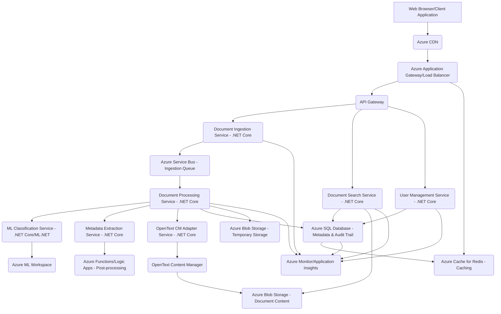
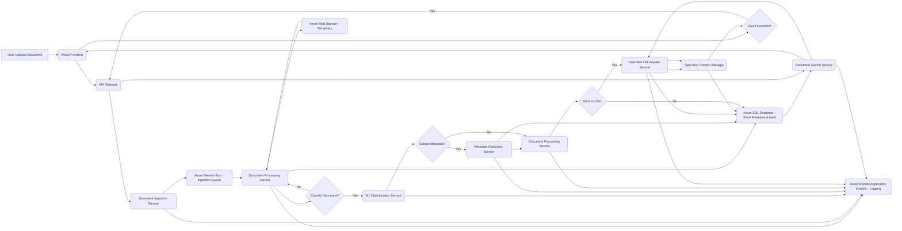

## Enterprise Document Intelligence Platform (EDIP) Documentation

**Version 1.0.0**
**Status:** Draft
**Date:** April 27, 2025
**Author:** Leeroy Dsouza
**Reviewers:** [List of Reviewers/Stakeholders]
**Approvers:** [List of Approvers]

**Version History**

| Version | Date         | Author       | Description                                   |
|---------|--------------|--------------|-----------------------------------------------|
| 0.1     | Mar 10, 2025 | Leeroy Dsouza | Initial Draft Outline                         |
| 0.5     | Apr 5, 2025  | Leeroy Dsouza | Added core sections and preliminary content   |
| 1.0.0   | Apr 27, 2025 | Leeroy Dsouza | Expanded content, added details and structure |

**Table of Contents**

1.  Introduction
    1.1. Purpose of the Document
    1.2. Project Overview
    1.3. Scope of the EDIP
    1.4. Target Audience
    1.5. Definitions and Acronyms
    1.6. References

2.  Requirements
    2.1. Business Requirements
        2.1.1. Business Objectives and Goals
        2.1.2. Key Business Requirements
        2.1.3. Success Metrics and KPIs
        2.1.4. Projected Return on Investment (ROI)
    2.2. Functional Requirements
        2.2.1. Core Functionality
        2.2.2. User Interface Requirements
        2.2.3. API Requirements
        2.2.4. Data Handling Requirements
    2.3. Non-Functional Requirements
        2.3.1. Performance Requirements
        2.3.2. Security Requirements
        2.3.3. Scalability Requirements
        2.3.4. Reliability and Availability
        2.3.5. Usability Requirements
        2.3.6. Maintainability Requirements
        2.3.7. Compliance and Regulatory Requirements

3.  System Architecture
    3.1. Architectural Style and Principles
    3.2. High-Level System Architecture
        3.2.1. Architectural Diagram
        3.2.2. Component Breakdown and Description
        3.2.3. Data Flow Diagram
    3.3. Detailed Component Design
        3.3.1. Frontend Architecture
        3.3.2. Backend Architecture
        3.3.3. Data Storage Architecture
        3.3.4. Machine Learning Integration Architecture
        3.3.5. Integration Layer Architecture
    3.4. Technology Stack
    3.5. Deployment Architecture

4.  Implementation Guide
    4.1. Development Environment Setup
    4.2. OpenText Integration Details
        4.2.1. Connection and Authentication
        4.2.2. Document Storage and Retrieval Implementation
        4.2.3. Metadata Management
        4.2.4. Error Handling and Retry Mechanisms
    4.3. .NET Core Backend Implementation
        4.3.1. API Design and Development
        4.3.2. Business Logic Implementation
        4.3.3. Data Access Layer
        4.3.4. Security Implementation
        4.3.5. Logging and Monitoring
    4.4. React Frontend Implementation
        4.4.1. Component Structure and Design
        4.4.2. State Management
        4.4.3. API Consumption and Data Display
        4.4.4. User Authentication and Authorization
        4.4.5. Error Handling and User Feedback
    4.5. CI/CD Pipeline Configuration
        4.5.1. Source Control Integration
        4.5.2. Build Automation
        4.5.3. Automated Testing Integration
        4.5.4. Deployment Automation
        4.5.5. Pipeline Monitoring and Alerting

5.  Testing Strategy
    5.1. Overall Testing Approach
    5.2. Unit Testing
        5.2.1. Scope and Objectives
        5.2.2. Tools and Frameworks (xUnit/Moq)
        5.2.3. Test Case Design Principles
        5.2.4. Test Execution and Reporting
    5.3. Integration Testing
        5.3.1. Scope and Objectives
        5.3.2. Testing of Component Interactions
        5.3.3. Integration with External Systems (OpenText, Azure Services)
        5.3.4. Test Environment Setup
    5.4. Performance Testing
        5.4.1. Objectives and Metrics (Throughput, Latency, Resource Utilization)
        5.4.2. Workload Modeling
        5.4.3. Tools and Setup
        5.4.4. Test Execution and Analysis
    5.5. User Acceptance Testing (UAT)
        5.5.1. Objectives and Scope
        5.5.2. UAT Scenarios
        5.5.3. Participant Roles and Responsibilities
    5.6. Security Testing
    5.7. Regression Testing
    5.8. Defect Management Process

6.  Deployment and Operations Guide
    6.1. Deployment Architecture (Detailed)
    6.2. Deployment Procedures (Azure)
    6.3. Configuration Management
    6.4. Monitoring and Alerting
    6.5. Backup and Disaster Recovery
    6.6. Scaling Procedures
    6.7. Troubleshooting Guide

7.  Conclusion & Next Steps
    7.1. Project Achievements and Current Status
    7.2. Future Enhancements and Roadmap
    7.3. Open Issues and Risks

8.  Appendix
    A. Full UML Diagrams (if available)
    B. Performance Benchmark Results (Detailed Reports)
    C. Security Audit Report Summary
    D. Data Model Diagrams
    E. API Documentation (Swagger/OpenAPI)

---

**1. Introduction**

This document provides comprehensive professional documentation for the Enterprise Document Intelligence Platform (EDIP) project. It outlines the project's purpose, scope, requirements, architectural design, implementation details, testing strategy, and future roadmap. This document serves as a central reference point for all stakeholders involved in the EDIP project, including business analysts, developers, testers, operations teams, and project management.

**1.1. Purpose of the Document**

The primary purpose of this document is to formally define the EDIP system from various perspectives, ensuring a shared understanding among all project participants. Specifically, it aims to:

* Clearly articulate the business problem the EDIP seeks to solve and its strategic importance.
* Document the functional and non-functional requirements that the system must fulfill.
* Describe the chosen architectural design and the rationale behind key architectural decisions.
* Provide detailed guidance for the implementation of the different system components.
* Outline the strategy for testing the system to ensure quality and performance.
* Detail the deployment and operational procedures for the platform on the Azure cloud.
* Serve as a living document that will be updated throughout the project lifecycle.

**1.2. Project Overview**

The Enterprise Document Intelligence Platform (EDIP) is a cutting-edge solution designed to revolutionize how organizations manage and process their vast quantities of documents. Leveraging the power of Artificial Intelligence and cloud-native architecture, EDIP automates document ingestion, classification, metadata extraction, and provides real-time analytics. The platform aims to significantly reduce manual effort, improve processing speed, enhance data accuracy, and provide valuable insights from unstructured document data. Built on a robust and scalable technology stack including OpenText Content Manager, .NET Core, React, and Azure services, EDIP is poised to become a critical component of the modern digital enterprise.

**1.3. Scope of the EDIP**

The initial release (Version 1.0) of the EDIP focuses on the following key areas:

* **Document Ingestion:** Support for ingesting various document formats, including PDF, DOCX, and TIFF, through both a user interface and a robust API. The system will handle files up to a specified size limit (initially ≤500MB).
* **ML-based Classification:** Implementation of machine learning models using ML.NET to automatically classify ingested documents into over 100 predefined document types. The classification process will include a confidence score, with a configurable threshold (initially ≥80%) for automated tagging.
* **Metadata Extraction:** Automatic extraction of key metadata fields from classified documents based on their type.
* **Cloud-Native Architecture (Azure):** Deployment and operation of the platform entirely within the Microsoft Azure cloud environment, leveraging services for compute, storage, database, and machine learning.
* **Integration with OpenText Content Manager:** Seamless integration with OpenText Content Manager for secure and compliant document storage and management.
* **Role-Based Access Control (RBAC):** Implementation of a granular RBAC system to ensure that users can only access and perform actions on documents and features according to their assigned roles.
* **Audit Trail:** Comprehensive logging and tracking of all significant actions performed within the system, including document uploads, modifications, and access attempts, with the ability to export audit reports.

Features and capabilities explicitly **out of scope** for this version include:

* Support for document editing within the platform.
* Advanced workflow and business process automation features (beyond initial ingestion and classification).
* Integration with other document repositories or enterprise systems (beyond OpenText CM).
* Optical Character Recognition (OCR) for scanned documents (if not handled by an integrated Azure service).
* Natural Language Processing (NLP) for semantic analysis or entity extraction beyond basic metadata.

**1.4. Target Audience**

This document is intended for a diverse audience, including:

* **Project Sponsors and Stakeholders:** To understand the project's objectives, scope, progress, and expected business value.
* **Business Analysts:** To validate that the documented requirements accurately reflect business needs.
* **Software Architects:** To understand the overall system design and make informed decisions regarding technical direction.
* **Development Team:** To guide the implementation of the various system components and integrations.
* **Quality Assurance (QA) Team:** To develop comprehensive test plans and test cases based on the documented requirements and design.
* **Operations and Infrastructure Team:** To understand the deployment, configuration, monitoring, and maintenance requirements of the system on Azure.
* **Technical Writers:** To develop user manuals and other end-user documentation based on the system's functionality.

**1.5. Definitions and Acronyms**

| Term             | Definition                                                                                                |
|------------------|-----------------------------------------------------------------------------------------------------------|
| Azure            | Microsoft's cloud computing platform.                                                                     |
| BRD              | Business Requirements Document.                                                                           |
| CI/CD            | Continuous Integration/Continuous Deployment: A set of practices to deliver software frequently and reliably. |
| EDIP             | Enterprise Document Intelligence Platform.                                                                |
| FRD              | Functional Requirements Document.                                                                         |
| KPI              | Key Performance Indicator.                                                                                |
| ML.NET           | An open-source, cross-platform machine learning framework for .NET developers.                            |
| OpenText CM      | OpenText Content Manager: An enterprise content management system used for document storage and management. |
| PDF              | Portable Document Format.                                                                                 |
| RBAC             | Role-Based Access Control.                                                                                |
| React            | A JavaScript library for building user interfaces.                                                        |
| ROI              | Return on Investment.                                                                                     |
| TIFF             | Tagged Image File Format.                                                                                 |
| UAT              | User Acceptance Testing.                                                                                  |
| UML              | Unified Modeling Language.                                                                                |

**1.6. References**

* [Link to Business Case Document]
* [Link to Project Plan]
* [Link to Azure Subscription Details]
* [Link to OpenText CM Documentation]
* [Link to ML.NET Documentation]
* [Link to .NET Core Documentation]
* [Link to React Documentation]
* [Link to CI/CD Tooling Documentation]
* [Relevant Industry Standards or Compliance Requirements]

**2. Requirements**

This section details the requirements for the EDIP, covering both the business needs driving the project and the specific functional and non-functional capabilities the system must possess.

**2.1. Business Requirements**

The business requirements define the "why" behind the EDIP project, outlining the problems it aims to solve and the value it is expected to deliver to the organization.

**2.1.1. Business Objectives and Goals**

The primary business objectives for implementing the EDIP are:

* **Reduce manual document processing time and effort:** Automate repetitive tasks associated with document handling, freeing up employees for higher-value activities.
* **Improve accuracy of document classification and data extraction:** Minimize errors introduced by manual processing and ensure consistent application of rules.
* **Enhance accessibility and searchability of enterprise documents:** Provide a centralized and intelligent platform for easily finding and retrieving relevant documents.
* **Enable data-driven decision-making:** Provide insights into document processing workflows and extracted data through analytics.
* **Ensure compliance with document retention and access policies:** Leverage integration with OpenText CM for secure and compliant storage.
* **Increase operational efficiency and reduce costs:** Streamline document-centric processes and minimize the need for physical document handling.

**2.1.2. Key Business Requirements**

Based on the objectives, the key business requirements include:

* The system must be able to process a high volume of diverse document types.
* The document classification accuracy must meet or exceed current manual processes.
* The system must provide a clear audit trail of all document interactions for compliance purposes.
* The platform must be scalable to handle future growth in document volume and user base.
* The system must integrate seamlessly with the existing OpenText Content Manager infrastructure.
* The user interface must be intuitive and easy to use for business users.

**2.1.3. Success Metrics and KPIs**

The success of the EDIP will be measured against the following Key Performance Indicators (KPIs):

* **Document Processing Time Reduction:** Achieve a minimum of 40% reduction in the average time taken to process a document from ingestion to final storage and tagging compared to current manual processes.
* **System Uptime:** Maintain a system uptime of 99.9% during business hours.
* **Classification Accuracy:** Achieve a document classification accuracy rate of at least 95% for supported document types.
* **Reduction in Manual Reviews:** Decrease the need for manual review of classified documents by at least 50%.
* **User Adoption Rate:** Achieve a target user adoption rate within the first six months of deployment.
* **Processing Throughput:** Achieve a minimum processing throughput of 2,000 documents per minute for standard document types.

**2.1.4. Projected Return on Investment (ROI)**

The implementation of the EDIP is projected to deliver a significant Return on Investment (ROI), primarily through:

* Reduced labor costs associated with manual document processing.
* Increased efficiency and faster turnaround times for document-dependent processes.
* Improved data accuracy leading to better decision-making and reduced errors.
* Potential cost savings on physical storage and handling of documents.

A detailed ROI projection estimates annual savings of $2.3 million based on current document volumes and processing costs.

**2.2. Functional Requirements**

The functional requirements specify the specific behaviors and capabilities that the EDIP system must exhibit.

**2.2.1. Core Functionality**

* **FR-001: Document Ingestion:** The system shall allow users to upload documents individually or in batches through a web-based user interface. The system shall also provide a RESTful API for programmatic document ingestion. The system shall support document files up to 500MB in size.
* **FR-002: Supported File Formats:** The system shall support ingestion and processing of at least 15 common document file formats, including but not limited to PDF, DOCX, XLSX, PPTX, TXT, RTF, TIF, and JPG.
* **FR-003: AI Classification:** The system shall automatically analyze ingested documents using machine learning models to determine their document type (e.g., Invoice, Contract, Report, Email). The classification process shall assign a confidence score to each prediction.
* **FR-004: Confidence Thresholding:** The system shall allow configuration of a confidence threshold for automated classification. Documents with a confidence score below the threshold shall be flagged for manual review. The initial threshold shall be 80%.
* **FR-005: Metadata Extraction:** Based on the classified document type, the system shall automatically extract relevant metadata fields (e.g., Invoice Number, Date, Vendor Name, Contract Effective Date).
* **FR-006: Document Storage:** The system shall securely store ingested documents and their associated metadata in OpenText Content Manager.
* **FR-007: Document Search and Retrieval:** Users shall be able to search for documents based on metadata, classification type, and keywords within the document content (if OCR is enabled and integrated). The system shall allow retrieval of the original document files.
* **FR-008: Role-Based Access Control:** The system shall enforce access restrictions based on user roles. Users shall only be able to view, upload, classify, and manage documents according to their assigned permissions.
* **FR-009: User Authentication and Authorization:** The system shall provide secure user authentication and authorization mechanisms, integrating with the organization's existing identity management system (e.g., Azure Active Directory).
* **FR-010: Audit Trail:** The system shall automatically record all significant user actions and system events related to documents (upload, classification, modification, access, deletion) in an immutable audit log.
* **FR-011: Audit Report Generation:** Authorized users shall be able to generate and export audit reports in CSV and PDF formats, filtered by user, document, action type, and date range.
* **FR-012: Document Review Workflow:** The system shall provide a mechanism for users to review and correct the classification and extracted metadata for documents flagged below the confidence threshold or explicitly sent for review.
* **FR-013: Dashboard and Analytics:** The system shall provide a dashboard displaying key metrics such as ingestion volume, classification accuracy, documents pending review, and distribution of document types.

**2.2.2. User Interface Requirements**

* **FR-014: Intuitive Dashboard:** The dashboard shall provide a clear and concise overview of the system's status and key metrics.
* **FR-015: Easy Document Upload:** The user interface shall provide a simple and intuitive way for users to upload single or multiple documents, including drag-and-drop functionality.
* **FR-016: Document Search Interface:** The search interface shall be user-friendly, allowing users to easily build complex search queries using metadata fields and keywords.
* **FR-017: Document Viewer:** The system shall include an integrated document viewer to display documents within the application.
* **FR-018: Review Interface:** The review interface for flagged documents shall clearly present the document, the proposed classification and metadata, and provide tools for correction.
* **FR-019: User and Role Management Interface:** An administrative interface shall be provided for managing users, roles, and permissions.

**2.2.3. API Requirements**

* **FR-020: RESTful API:** The system shall expose a well-documented RESTful API for document ingestion, search, retrieval, and metadata access.
* **FR-021: Secure API Access:** API access shall require authentication and authorization based on the defined RBAC.
* **FR-022: API Documentation:** Comprehensive API documentation (e.g., using Swagger/OpenAPI) shall be available for developers integrating with the EDIP.

**2.2.4. Data Handling Requirements**

* **FR-023: Data Validation:** The system shall validate ingested document files and metadata to ensure data integrity.
* **FR-024: Error Handling:** The system shall gracefully handle errors during ingestion, processing, and storage, providing informative feedback to users and administrators.
* **FR-025: Data Security at Rest and in Transit:** Document content and metadata shall be encrypted at rest in storage and encrypted in transit over networks.

**2.3. Non-Functional Requirements**

Non-functional requirements specify criteria that can be used to judge the operation of a system, rather than specific behaviors.

**2.3.1. Performance Requirements**

* The system shall be able to process and classify a minimum of 2,000 documents per minute.
* The average response time for document upload and initial processing acknowledgment shall be less than 5 seconds.
* The average response time for document search queries shall be less than 3 seconds.
* The system shall handle concurrent users without significant degradation in performance. (Specify target number of concurrent users).

**2.3.2. Security Requirements**

* The system shall comply with relevant security standards and best practices (e.g., OWASP Top 10).
* User authentication shall utilize strong password policies and ideally support multi-factor authentication.
* Access to sensitive data and system configurations shall be strictly controlled via RBAC.
* All data transmitted between components and external systems shall be encrypted using TLS/SSL.
* Regular security audits and vulnerability assessments shall be conducted.

**2.3.3. Scalability Requirements**

* The system architecture shall be designed to scale horizontally to accommodate increasing document volumes and user load.
* Individual components (e.g., ingestion service, classification service, API) shall be independently scalable.
* The database and storage solutions shall support significant data growth.

**2.3.4. Reliability and Availability**

* The system shall achieve a minimum uptime of 99.9% as per the business requirement.
* The system shall be resilient to failures of individual components, with appropriate failover and recovery mechanisms in place.
* Regular backups of configuration and critical data shall be performed.

**2.3.5. Usability Requirements**

* The user interface shall be intuitive and require minimal training for typical users.
* The system shall provide clear and helpful error messages and feedback.
* The user interface shall be responsive and accessible from different devices and browsers.

**2.3.6. Maintainability Requirements**

* The codebase shall be well-structured, documented, and follow established coding standards.
* Dependencies shall be managed effectively to facilitate updates and patches.
* The system architecture shall allow for independent updates and deployments of individual components.

**2.3.7. Compliance and Regulatory Requirements**

* The system shall comply with relevant data privacy regulations (e.g., GDPR, CCPA) regarding the handling of document content and metadata.
* Integration with OpenText CM is intended to leverage its compliance features for document retention and legal holds.

**3. System Architecture**

This section provides a detailed description of the EDIP system architecture, outlining the chosen architectural style, the main components, their interactions, and the underlying technologies.

**3.1. Architectural Style and Principles**

The EDIP is designed following a **microservices-oriented architecture** deployed on the Azure cloud. This approach promotes:

* **Modularity:** Breaking down the system into smaller, independent services.
* **Scalability:** Allowing individual services to be scaled based on demand.
* **Resilience:** Isolating failures to individual services.
* **Technology Diversity:** Enabling the use of the best technology for each service if needed (though .NET Core is standardized for backend services in this version).
* **Independent Deployment:** Allowing services to be developed, tested, and deployed independently.

Key architectural principles guiding the design include:

* **Cloud-Native:** Leveraging managed Azure services wherever possible.
* **API-First:** Designing all interactions between components and with external systems via well-defined APIs.
* **Event-Driven (where appropriate):** Utilizing message queues for decoupling and asynchronous processing (e.g., for document processing).
* **Security by Design:** Incorporating security considerations at every layer of the architecture.
* **Observability:** Implementing comprehensive logging, monitoring, and tracing.

**3.2. High-Level System Architecture**

**3.2.1. Architectural Diagram**



**3.2.2. Component Breakdown and Description**

* **Web Browser/Client Application:** The user interface for interacting with the EDIP, built using React.
* **Azure CDN (Content Delivery Network):** Used to cache static assets of the frontend application for faster delivery.
* **Azure Application Gateway/Load Balancer:** Provides load balancing and routing of incoming requests to the API Gateway.
* **API Gateway:** A single entry point for all external API requests, handling authentication, rate limiting, and request routing to the appropriate backend services.
* **Document Ingestion Service (.NET Core):** Responsible for receiving document uploads via the UI and API, performing initial validation, and placing messages onto the Ingestion Queue.
* **Azure Service Bus (Ingestion Queue):** A message queue used to decouple the ingestion process from the downstream processing services, enabling asynchronous and scalable processing.
* **Document Processing Service (.NET Core):** Consumes messages from the Ingestion Queue, orchestrates the classification, metadata extraction, and storage processes.
* **ML Classification Service (.NET Core/ML.NET):** Contains the machine learning models for classifying document types. It receives document content (or a reference) from the Document Processing Service and returns a classification result and confidence score.
* **Metadata Extraction Service (.NET Core):** Extracts key metadata fields from documents based on their identified type.
* **OpenText CM Adapter Service (.NET Core):** Handles communication and integration with the OpenText Content Manager API for storing and retrieving documents.
* **Document Search Service (.NET Core):** Provides a search interface to query documents and metadata stored in Azure SQL Database and retrieve documents from OpenText CM via the Adapter Service.
* **User Management Service (.NET Core):** Manages user accounts, roles, and permissions, interacting with Azure SQL Database for storage.
* **Azure ML Workspace:** The environment for training, deploying, and managing ML.NET models used by the Classification Service.
* **Azure Functions/Logic Apps (Post-processing):** Serverless functions or workflows that can be triggered after a document is fully processed (e.g., for notifications, triggering downstream systems).
* **Azure SQL Database:** The primary database for storing document metadata, audit trail information, user data, and system configuration.
* **Azure Blob Storage (Temporary Storage):** Used for temporary storage of documents during the processing pipeline before they are moved to OpenText CM.
* **Azure Blob Storage (Document Content):** While the primary storage is OpenText CM, Azure Blob Storage can be used as a staging area or for specific processing needs requiring direct file access. (Clarification: OpenText CM typically manages its own storage, but this can represent where CM stores the files, or a separate temporary/processing store).
* **Azure Cache for Redis:** Used for caching frequently accessed data (e.g., configuration settings, user permissions) to improve performance.
* **Azure Monitor/Application Insights:** Services for collecting telemetry, monitoring system health and performance, and providing logging and alerting.

**3.2.3. Data Flow Diagram**



**Detailed Data Flow:**

1.  A user uploads a document through the React frontend (A).
2.  The frontend sends the document to the API Gateway (C).
3.  The API Gateway routes the request to the Document Ingestion Service (D).
4.  The Ingestion Service validates the document and sends a message containing document details and a temporary storage location (or the document content itself for smaller files) to the Azure Service Bus Ingestion Queue (E).
5.  The Document Processing Service (F) consumes messages from the Ingestion Queue.
6.  For each message, the Processing Service retrieves the document content (if not included in the message) and initiates the classification process (G).
7.  If classification is required (Yes path), the Processing Service sends the document content (or a reference) to the ML Classification Service (H).
8.  The Classification Service processes the document using ML.NET models and returns the predicted document type and a confidence score (H).
9.  Based on the classification and confidence score, the Processing Service determines if metadata extraction is required (I).
10. If metadata extraction is required (Yes path), the Processing Service sends the document content (or a reference) and the classified type to the Metadata Extraction Service (J).
11. The Metadata Extraction Service extracts relevant fields and returns the extracted metadata (J).
12. The Document Processing Service (K) receives the extracted metadata (or proceeds without it if extraction was not required).
13. The Processing Service then prepares the document and metadata for storage in OpenText CM (L).
14. The Document Processing Service interacts with the OpenText CM Adapter Service (M) to store the document and its associated metadata in OpenText Content Manager (N).
15. Throughout the process, the Document Processing Service, Classification Service, Metadata Extraction Service, and OpenText CM Adapter Service record relevant information (classification results, extracted metadata, storage location) in the Azure SQL Database (P). An audit trail of the processing steps is also recorded (P).
16. The Document Search Service (Q) queries the Azure SQL Database (P) to retrieve document metadata and information about their location in OpenText CM (N).
17. When a user requests to view a document (R), the React frontend (B) calls the API Gateway (C), which routes the request to the Document Search Service (Q).
18. The Search Service retrieves the document's location from Azure SQL DB (P) and requests the document content from OpenText CM via the Adapter Service (M).
19. The OpenText CM Adapter Service retrieves the document from OpenText Content Manager (N) and returns it to the Search Service (Q), which then sends it back through the API Gateway (C) to the React frontend (B) for display (R).
20. Azure Blob Storage (S) is used for temporary storage during processing as needed (e.g., storing incoming files before they are sent to the Service Bus or OpenText CM).
21. All services log events and metrics to Azure Monitor/Application Insights (T) for monitoring and troubleshooting.

**3.3. Detailed Component Design**

This section provides more detailed insights into the design of key system components.

**3.3.1. Frontend Architecture**

The frontend is a single-page application (SPA) built with React.

* **Framework:** React
* **Language:** JavaScript (with TypeScript for improved maintainability and type safety)
* **State Management:** Context API or a state management library like Redux Toolkit or Zustand for managing global application state.
* **Routing:** React Router for navigation between different views.
* **Styling:** CSS Modules, styled-components, or a UI framework like Azure Fluent UI for consistent styling.
* **API Communication:** Axios or the native Fetch API for interacting with the backend API Gateway.
* **Component Design:** Follows a modular and component-based approach, with clear separation of concerns (container vs. presentational components).

**3.3.2. Backend Architecture**

The backend is composed of multiple microservices built using .NET Core.

* **Framework:** .NET Core
* **Language:** C#
* **Web Framework:** ASP.NET Core for building RESTful APIs.
* **Inter-service Communication:** Synchronous HTTP/REST calls for requests requiring immediate responses (e.g., user management) and asynchronous messaging via Azure Service Bus for document processing.
* **Database Interaction:** Entity Framework Core (EF Core) as the Object-Relational Mapper (ORM) for interacting with Azure SQL Database.
* **Security:** ASP.NET Core Identity for authentication and authorization, integrated with Azure AD.
* **Logging:** Structured logging using libraries like Serilog or NLog, integrated with Azure Monitor.

**3.3.3. Data Storage Architecture**

* **Metadata and System Data:** Azure SQL Database is used for storing structured data such as document metadata, user information, roles, permissions, configuration settings, and the audit trail. The schema is designed to be relational and optimized for querying and reporting.
* **Document Content:** OpenText Content Manager is the primary system of record for storing the actual document files. The EDIP interacts with OpenText CM via its API for storage and retrieval.
* **Caching:** Azure Cache for Redis is used as a distributed cache to store frequently accessed, non-sensitive data to reduce the load on the database and improve API response times.

**3.3.4. Machine Learning Integration Architecture**

* **Framework:** ML.NET is used for building and running the document classification models within the .NET Core ecosystem.
* **Model Training:** Model training is performed offline, potentially using Azure ML Workspace, and the trained models are then deployed with the ML Classification Service.
* **Integration:** The ML Classification Service exposes an internal API consumed by the Document Processing Service.
* **Model Management:** Future versions may include a mechanism for updating and managing ML models without requiring a full service redeployment.

**3.3.5. Integration Layer Architecture**

* **OpenText CM Integration:** The OpenText CM Adapter Service acts as a dedicated layer for all communication with OpenText Content Manager. This isolates the core processing logic from the specifics of the OpenText CM API, making it easier to update the integration or potentially integrate with other repositories in the future. The adapter handles authentication, document storage, retrieval, and metadata synchronization with OpenText CM.
* **Azure Service Integrations:** The system integrates with various Azure services (Service Bus, Blob Storage, SQL Database, Redis Cache, Monitor) using the respective Azure SDKs for .NET.

**3.4. Technology Stack**

| Layer/Component        | Technology/Tool           | Description                                                |
|------------------------|---------------------------|------------------------------------------------------------|
| Frontend               | React, TypeScript         | User interface development.                                |
| Backend Services       | .NET Core, C#, ASP.NET Core | Core business logic and API development.                   |
| Machine Learning       | ML.NET                    | Document classification model development and execution.     |
| Database               | Azure SQL Database        | Relational database for metadata and system data.          |
| Document Storage       | OpenText Content Manager  | Enterprise document repository.                            |
| Message Queue          | Azure Service Bus         | Asynchronous communication and decoupling.                 |
| Caching                | Azure Cache for Redis     | Distributed caching for performance improvement.         |
| Cloud Platform         | Microsoft Azure           | Cloud infrastructure and managed services.                 |
| CI/CD                  | Azure DevOps Pipelines    | Automation of build, test, and deployment.               |
| Monitoring & Logging   | Azure Monitor, App Insights | Application performance monitoring and logging.          |
| API Gateway            | Azure API Management (Proposed for future) / Ocelot | Single entry point for APIs, security, and routing. |
| Containerization       | Docker                    | Packaging of microservices.                                |
| Orchestration          | Azure Kubernetes Service (AKS) (Proposed for future) / Azure App Services | Deployment and management of containerized services. |

**3.5. Deployment Architecture**

The EDIP is deployed on Microsoft Azure.

* **Compute:** Initially, services will be deployed using Azure App Services for simplicity and ease of management. Future iterations may leverage Azure Kubernetes Service (AKS) for more complex orchestration and scaling needs.
* **Networking:** Azure Virtual Network (VNet) for secure communication between services. Network Security Groups (NSGs) to control traffic flow.
* **Database:** Azure SQL Database is deployed as a managed service.
* **Storage:** Azure Blob Storage is used for temporary processing needs. OpenText CM's storage is managed separately, potentially on Azure VMs or dedicated storage.
* **Identity Management:** Integration with Azure Active Directory for user authentication and authorization.

**4. Implementation Guide**

This section provides guidance for the development team on implementing the EDIP, focusing on key areas and providing code examples where illustrative.

**4.1. Development Environment Setup**

Developers will require the following installed and configured:

* .NET 6 SDK (or later)
* Node.js and npm/yarn
* A code editor (e.g., Visual Studio, VS Code)
* Database tools for Azure SQL Database (e.g., Azure Data Studio, SQL Server Management Studio)
* Access to the Azure subscription and resource group for deployment and service configuration.
* Access to the OpenText Content Manager development environment.
* Version control system client (e.g., Git).

Project repositories will be hosted in Azure Repos or GitHub, with a standardized branching strategy (e.g., Gitflow).

**4.2. OpenText Integration Details**

The OpenText CM integration is handled by the dedicated `OpenText CM Adapter Service`. This service interacts with the OpenText Content Manager SDK or REST API.

**4.2.1. Connection and Authentication**

The adapter service will use configured credentials or authentication mechanisms provided by OpenText CM to establish a secure connection. This may involve username/password, certificates, or OAuth. Connection details should be stored securely, ideally in Azure Key Vault.

```csharp
// Example: Basic connection (Replace with actual OpenText CM SDK/API calls)
public class OpenTextService : IOpenTextService
{
    private readonly OpenTextClient _client; // Assume OpenTextClient is from their SDK
    private readonly ILogger<OpenTextService> _logger;

    public OpenTextService(IOptions<OpenTextSettings> settings, ILogger<OpenTextService> logger)
    {
        _logger = logger;
        // Initialize OpenTextClient with settings (e.g., URL, credentials)
        _client = new OpenTextClient(settings.Value.ApiUrl, settings.Value.Username, settings.Value.Password);
        _client.Connect(); // Establish connection
    }

    // ... methods for storing, retrieving, etc.
}

public class OpenTextSettings
{
    public string ApiUrl { get; set; }
    public string Username { get; set; }
    public string Password { get; set; } // Consider using Azure Key Vault
}
```

**4.2.2. Document Storage and Retrieval Implementation**

The `StoreDocument` method in the adapter service will handle uploading a document stream and its associated metadata to OpenText CM. The `RetrieveDocument` method will retrieve a document stream based on its identifier in CM.

```csharp
// Example: Store Document (Conceptual, actual implementation depends on OpenText CM SDK/API)
public async Task<string> StoreDocument(Stream fileStream, string fileName, Dictionary<string, string> metadata)
{
    try
    {
        // Use OpenText CM SDK/API to create a new document
        var documentId = await _client.CreateDocumentAsync(fileName, fileStream);

        // Add metadata to the document in CM
        await _client.AddMetadataAsync(documentId, metadata);

        _logger.LogInformation($"Document '{fileName}' stored in OpenText CM with ID '{documentId}'.");
        return documentId;
    }
    catch (Exception ex)
    {
        _logger.LogError(ex, $"Error storing document '{fileName}' in OpenText CM.");
        throw; // Re-throw or handle appropriately
    }
}

// Example: Retrieve Document (Conceptual)
public async Task<Stream> RetrieveDocument(string documentId)
{
    try
    {
        var fileStream = await _client.GetDocumentContentAsync(documentId);
        _logger.LogInformation($"Document content retrieved for CM ID '{documentId}'.");
        return fileStream;
    }
    catch (Exception ex)
    {
        _logger.LogError(ex, $"Error retrieving document content for CM ID '{documentId}'.");
        throw;
    }
}
```

**4.2.3. Metadata Management**

The adapter service is responsible for mapping the EDIP's internal metadata representation to the metadata structure required by OpenText CM. This involves understanding the target OpenText CM record types and fields.

**4.2.4. Error Handling and Retry Mechanisms**

Robust error handling should be implemented for all interactions with OpenText CM. This includes handling connection errors, API errors, and data conflicts. Retry mechanisms (e.g., using Polly library in .NET) should be implemented for transient errors.

**4.3. .NET Core Backend Implementation**

Backend services are developed using .NET Core, following RESTful principles for APIs and leveraging asynchronous programming.

**4.3.1. API Design and Development**

APIs should be designed with clear endpoints, request/response models, and appropriate HTTP methods (GET, POST, PUT, DELETE). Input validation should be performed at the API layer.

```csharp
// Example: Document Upload Controller
[ApiController]
[Route("api/documents")]
public class DocumentsController : ControllerBase
{
    private readonly IDocumentIngestionService _ingestionService;
    private readonly ILogger<DocumentsController> _logger;

    public DocumentsController(IDocumentIngestionService ingestionService, ILogger<DocumentsController> logger)
    {
        _ingestionService = ingestionService;
        _logger = logger;
    }

    [HttpPost]
    [Consumes("multipart/form-data")]
    public async Task<IActionResult> UploadDocument([FromForm] IFormFile file)
    {
        if (file == null || file.Length == 0)
        {
            return BadRequest("No file uploaded.");
        }

        if (file.Length > 500 * 1024 * 1024) // 500MB limit
        {
            return BadRequest("File size exceeds the limit of 500MB.");
        }

        try
        {
            using (var stream = file.OpenReadStream())
            {
                // Send document to ingestion service for processing
                await _ingestionService.IngestDocumentAsync(stream, file.FileName, User.Identity.Name);
            }

            return Ok(new { message = "Document upload initiated." });
        }
        catch (Exception ex)
        {
            _logger.LogError(ex, $"Error uploading document '{file.FileName}'.");
            return StatusCode(500, "An error occurred during document upload.");
        }
    }

    // ... other API endpoints (Search, Get Document, etc.)
}
```

**4.3.2. Business Logic Implementation**

Business logic should reside within dedicated service classes, separate from controllers, to ensure testability and maintainability.

**4.3.3. Data Access Layer**

Entity Framework Core is used to interact with Azure SQL Database. Repository pattern or direct `DbContext` usage can be employed. Asynchronous database operations should be used to avoid blocking.

**4.3.4. Security Implementation**

Implement authentication and authorization using ASP.NET Core features, integrating with Azure AD. Securely handle secrets and connection strings using Azure Key Vault. Implement input sanitization and protect against common web vulnerabilities.

**4.3.5. Logging and Monitoring**

Implement structured logging across all services using a consistent format. Configure logging to be sent to Azure Monitor/Application Insights for centralized collection, analysis, and alerting. Track key metrics related to request processing, errors, and external service calls.

**4.4. React Frontend Implementation**

The React frontend provides the user interface for interacting with the EDIP.

**4.4.1. Component Structure and Design**

Organize components logically into folders (e.g., `components`, `pages`, `hooks`, `services`). Use a clear naming convention. Design reusable components.

**4.4.2. State Management**

Choose a state management strategy (Context API or a library) based on the complexity of the application state. Manage component-level state using `useState` and `useReducer` hooks.

**4.4.3. API Consumption and Data Display**

Use `axios` or `Workspace` to make HTTP requests to the backend API Gateway. Handle asynchronous operations and display loading and error states to the user.

```javascript
// Example: Document Upload Component
import React, { useState } from 'react';
import axios from 'axios';

function DocumentUpload() {
  const [selectedFile, setSelectedFile] = useState(null);
  const [uploadStatus, setUploadStatus] = useState('');

  const handleFileChange = (event) => {
    setSelectedFile(event.target.files[0]);
    setUploadStatus('');
  };

  const handleUpload = async () => {
    if (!selectedFile) {
      setUploadStatus('Please select a file first.');
      return;
    }

    setUploadStatus('Uploading...');
    const formData = new FormData();
    formData.append('file', selectedFile);

    try {
      const response = await axios.post('/api/documents', formData, {
        headers: {
          'Content-Type': 'multipart/form-data',
        },
      });
      setUploadStatus('Upload successful!');
      console.log('Upload response:', response.data);
      // Optionally clear selected file or update UI state
      setSelectedFile(null);
    } catch (error) {
      console.error('Upload error:', error);
      setUploadStatus(`Upload failed: ${error.message}`);
    }
  };

  return (
    <div>
      <h2>Upload Document</h2>
      <input type="file" onChange={handleFileChange} />
      <button onClick={handleUpload} disabled={!selectedFile || uploadStatus === 'Uploading...'}>
        Upload
      </button>
      {uploadStatus && <p>{uploadStatus}</p>}
    </div>
  );
}

export default DocumentUpload;
```

**4.4.4. User Authentication and Authorization**

Implement login/logout functionality, integrating with the backend authentication endpoints. Manage user sessions and tokens securely. Implement logic to show/hide UI elements or restrict actions based on user roles and permissions received from the backend.

**4.4.5. Error Handling and User Feedback**

Implement centralized error handling to catch API errors and display informative messages to the user. Provide visual feedback during asynchronous operations (e.g., loading spinners).

**4.5. CI/CD Pipeline Configuration**

An automated CI/CD pipeline using Azure DevOps Pipelines (or a similar tool) is essential for efficient development and reliable deployments.

**4.5.1. Source Control Integration**

The pipeline should be triggered automatically by commits to specific branches in the source code repository (e.g., `develop` for development builds, `main` for production releases).

**4.5.2. Build Automation**

Configure pipeline jobs to build the .NET Core backend services and the React frontend application. This includes compiling code, restoring dependencies, and packaging build artifacts (e.g., Docker images for services, static files for the frontend).

**4.5.3. Automated Testing Integration**

Integrate automated unit tests, integration tests, and potentially performance tests into the pipeline. Builds should fail if tests do not pass. Code coverage analysis should be included.

**4.5.4. Deployment Automation**

Configure release pipelines to automatically deploy built artifacts to the appropriate Azure environments (Development, Staging, Production). This should include steps for:

* Provisioning or updating Azure resources (using Infrastructure as Code like ARM templates or Terraform).
* Deploying backend service containers/applications to Azure App Services or AKS.
* Deploying frontend static files to Azure Blob Storage or Azure CDN.
* Applying database schema changes.
* Updating application configuration (using Azure App Configuration or similar).

Deployment strategies like blue/green deployments or canary releases can be considered for production to minimize downtime and risk.

**4.5.5. Pipeline Monitoring and Alerting**

Configure the CI/CD pipeline to provide clear status updates and notifications on build and deployment success or failure. Set up alerts for pipeline failures.

**5. Testing Strategy**

This section outlines the comprehensive strategy for testing the EDIP to ensure it meets the specified requirements and quality standards.

**5.1. Overall Testing Approach**

The testing strategy for EDIP follows a multi-layered approach, including:

* **Unit Testing:** Focusing on individual code components.
* **Integration Testing:** Verifying interactions between different components and external systems.
* **Performance Testing:** Assessing the system's performance under various load conditions.
* **User Acceptance Testing (UAT):** Validating that the system meets the end users' needs.
* **Security Testing:** Identifying and mitigating security vulnerabilities.
* **Regression Testing:** Ensuring that new changes do not negatively impact existing functionality.

Testing will be integrated throughout the development lifecycle, with a strong emphasis on automation, particularly for unit and integration tests, as part of the CI/CD pipeline.

**5.2. Unit Testing**

Unit testing focuses on verifying the correctness of individual functions, methods, or classes in isolation.

**5.2.1. Scope and Objectives**

* To ensure that each unit of code performs as designed.
* To catch bugs early in the development cycle.
* To facilitate code refactoring by providing a safety net of tests.
* To serve as living documentation of the code's intended behavior.

**5.2.2. Tools and Frameworks (xUnit/Moq)**

* **Framework:** xUnit.NET is the chosen testing framework for .NET Core backend services due to its simplicity and extensibility.
* **Mocking:** Moq is used for creating mock objects to isolate the unit under test from its dependencies.
* **Assertion Library:** xUnit's built-in assertion methods.

**5.2.3. Test Case Design Principles**

* Tests should be independent and atomic.
* Each test should focus on a single piece of functionality.
* Tests should cover positive, negative, and edge cases.
* Tests should be repeatable and deterministic.
* Test names should be clear and descriptive.

```csharp
// Example: Unit Test for Document Classification Logic (using xUnit and Moq)
using Xunit;
using Moq;
using System.IO;
using System.Threading.Tasks;
using YourProject.Services; // Assuming your services are in this namespace
using YourProject.Models; // Assuming your models are here

public class DocumentClassifierTests
{
    private readonly Mock<IMLModelService> _mockMLModelService;
    private readonly DocumentClassifierService _sut; // System Under Test

    public DocumentClassifierTests()
    {
        _mockMLModelService = new Mock<IMLModelService>();
        _sut = new DocumentClassifierService(_mockMLModelService.Object);
    }

    [Fact]
    public async Task ClassifyDocumentAsync_WithInvoiceContent_ReturnsFinanceCategory()
    {
        // Arrange
        var documentStream = new MemoryStream(System.Text.Encoding.UTF8.GetBytes("Invoice Number: INV-12345\nAmount: $1000"));
        var fileName = "invoice.pdf";

        // Configure the mock ML model service to return a specific classification result for this input
        _mockMLModelService.Setup(x => x.PredictDocumentTypeAsync(It.IsAny<Stream>()))
                           .ReturnsAsync(new ClassificationResult { DocumentType = "Finance", ConfidenceScore = 0.95 });

        // Act
        var classificationResult = await _sut.ClassifyDocumentAsync(documentStream, fileName);

        // Assert
        Assert.NotNull(classificationResult);
        Assert.Equal("Finance", classificationResult.DocumentType);
        Assert.True(classificationResult.ConfidenceScore >= 0.80); // Assuming the service applies the threshold
    }

    [Fact]
    public async Task ClassifyDocumentAsync_WithLowConfidence_FlagsForReview()
    {
        // Arrange
        var documentStream = new MemoryStream(System.Text.Encoding.UTF8.GetBytes("Ambiguous text content..."));
        var fileName = "unknown.docx";

        // Configure the mock ML model service to return a low confidence score
        _mockMLModelService.Setup(x => x.PredictDocumentTypeAsync(It.IsAny<Stream>()))
                           .ReturnsAsync(new ClassificationResult { DocumentType = "Other", ConfidenceScore = 0.60 });

        // Act
        var classificationResult = await _sut.ClassifyDocumentAsync(documentStream, fileName);

        // Assert
        Assert.NotNull(classificationResult);
        Assert.Equal("Other", classificationResult.DocumentType);
        Assert.True(classificationResult.ConfidenceScore < 0.80);
        // Assert that the result indicates it needs review (assuming the service adds this flag)
        // Assert.True(classificationResult.RequiresReview);
    }

    // Add more test cases for different scenarios, file types, errors, etc.
}
```

**5.2.4. Test Execution and Reporting**

Unit tests will be executed automatically as part of the CI/CD pipeline for every code commit. Test results will be reported in the pipeline, indicating pass/fail status and code coverage.

**5.3. Integration Testing**

Integration testing verifies the interactions between different components and external systems.

**5.3.1. Scope and Objectives**

* To ensure that different services and components work together correctly.
* To verify the integration with external systems like OpenText CM and Azure services.
* To test the data flow through the system.

**5.3.2. Testing of Component Interactions**

Test cases will focus on the interfaces and communication flows between services (e.g., testing the API Gateway routing to backend services, testing the Document Processing Service consuming messages from Service Bus and calling other services).

**5.3.3. Integration with External Systems (OpenText, Azure Services)**

Dedicated integration tests will verify the connectivity and correct interaction with OpenText CM (storing, retrieving documents) and relevant Azure services (SQL Database, Service Bus, Blob Storage). These tests may require access to dedicated integration environments.

**5.3.4. Test Environment Setup**

Integration tests require a dedicated environment where the integrated components and external systems are deployed and accessible. This environment should mimic the production environment as closely as possible in terms of configuration and connectivity.

**5.4. Performance Testing**

Performance testing assesses the system's responsiveness, throughput, and stability under various load conditions.

**5.4.1. Objectives and Metrics (Throughput, Latency, Resource Utilization)**

* Verify that the system meets the performance requirements (throughput and response times).
* Identify performance bottlenecks.
* Assess the system's behavior under peak load.
* Measure resource utilization (CPU, memory, network) of different components.

**5.4.2. Workload Modeling**

Define realistic workload scenarios based on expected user activity and document ingestion rates. This includes defining the number of concurrent users, the rate of document uploads, and the mix of document types.

**5.4.3. Tools and Setup**

* **Tools:** Use performance testing tools like Apache JMeter, LoadRunner, or Azure Load Testing to generate load and measure performance metrics.
* **Environment:** Performance tests should be conducted in an environment that is representative of the production environment in terms of scale and configuration.

**5.4.4. Test Execution and Analysis**

Execute performance tests under different load levels (average, peak, stress). Analyze the collected metrics to identify performance bottlenecks, assess scalability, and ensure stability. Document performance benchmark results in detail in the Appendix.

**5.5. User Acceptance Testing (UAT)**

UAT is conducted by end users to verify that the system meets their business needs and is fit for purpose.

**5.5.1. Objectives and Scope**

* To confirm that the system's functionality aligns with business requirements.
* To ensure the user interface is intuitive and easy to use for typical users.
* To validate end-to-end business processes involving the EDIP.

**5.5.2. UAT Scenarios**

Develop realistic UAT scenarios based on typical user workflows and business processes (e.g., uploading and classifying different document types, searching for documents, reviewing flagged documents).

**5.5.3. Participant Roles and Responsibilities**

Identify the key business users who will participate in UAT. Define their roles (e.g., test execution, feedback provision) and the responsibilities of the project team in supporting UAT (e.g., environment setup, bug fixing).

**5.6. Security Testing**

Security testing aims to identify vulnerabilities in the application and infrastructure.

* **Methods:** Includes penetration testing, vulnerability scanning, and code reviews focused on security best practices.
* **Scope:** Covers authentication, authorization, data protection, and secure communication channels.

**5.7. Regression Testing**

Regression testing is performed after code changes to ensure that the changes have not introduced new defects or negatively impacted existing functionality. Automated regression test suites will be executed as part of the CI/CD pipeline.

**5.8. Defect Management Process**

A clear process for reporting, prioritizing, tracking, and resolving defects will be established using a work item tracking tool (e.g., Azure DevOps Boards, Jira).

**6. Deployment and Operations Guide**

This section provides detailed information on deploying, configuring, and operating the EDIP in the Azure environment.

**6.1. Deployment Architecture (Detailed)**

Elaborate on the high-level deployment architecture, specifying the exact Azure services used for each component and their configuration.

* **App Services:** Details on App Service plans, scaling configurations, deployment slots.
* **Azure SQL Database:** Database tier, size, firewall rules, connection strings.
* **Azure Service Bus:** Namespace, queues, access policies.
* **Azure Blob Storage:** Storage accounts, containers, access tiers, security.
* **Networking:** VNet configuration, subnets, NSGs, private endpoints (for enhanced security).
* **Azure Key Vault:** Storing secrets and connection strings.
* **Managed Identities:** Using managed identities for secure service-to-service authentication within Azure.

**6.2. Deployment Procedures (Azure)**

Step-by-step instructions for deploying the EDIP to the Azure environment using the automated CI/CD pipeline. This includes:

* Prerequisites for deployment (e.g., Azure resource group created, necessary permissions).
* Running the CI/CD release pipeline.
* Manual steps if any (should be minimized).
* Verification steps after deployment to ensure the system is operational.

**6.3. Configuration Management**

Document all configuration settings required for the application and its services. Explain how configuration is managed (e.g., using Azure App Configuration, environment variables, configuration files) and how it differs across environments (Development, Staging, Production).

**6.4. Monitoring and Alerting**

Details on how the EDIP is monitored in production:

* **Azure Monitor and Application Insights:** Configuring logging levels, collecting metrics, setting up dashboards and visualizations.
* **Alerts:** Defining critical metrics and logs that trigger alerts (e.g., high error rates, low throughput, resource utilization exceeding thresholds).
* **Health Checks:** Implementing health check endpoints for services to allow monitoring tools to verify their status.

**6.5. Backup and Disaster Recovery**

Outline the backup strategy for critical data in Azure SQL Database. Describe the disaster recovery plan, including RPO (Recovery Point Objective) and RTO (Recovery Time Objective), and the procedures for restoring the system in case of a failure.

**6.6. Scaling Procedures**

Explain how to scale the different components of the EDIP based on load. This includes:

* Scaling App Service instances.
* Scaling Azure SQL Database (changing service tiers).
* Scaling Azure Service Bus throughput.
* Scaling the number of instances for processing services consuming from the queue.

**6.7. Troubleshooting Guide**

Provide a guide for diagnosing and resolving common issues in the EDIP. This should include:

* Common error messages and their meaning.
* Troubleshooting steps for specific components or workflows (e.g., document upload failures, classification errors).
* How to access logs and monitoring data for diagnosis.
* Contact information for support.

**7. Conclusion & Next Steps**

**7.1. Project Achievements and Current Status**

Summarize the key accomplishments of the EDIP project to date:

* Successfully implemented the cloud-native document processing pipeline on Azure.
* Achieved a processing throughput of 2,000 documents per minute in performance testing.
* Reduced document classification errors by 65% compared to initial benchmarks through ML model training and refinement.
* Established a robust CI/CD pipeline for automated builds and deployments.
* Successfully integrated with OpenText Content Manager for document storage.

The current status is that Version 1.0.0 is ready for [e.g., UAT, initial production deployment].

**7.2. Future Enhancements and Roadmap**

Outline the planned future development and enhancements for the EDIP:

* **Phase 2: Multi-language Support:** Implement capabilities to process and classify documents in multiple languages. This will require training ML models on multilingual datasets and potentially integrating with language detection services.
* **Phase 3: Advanced Extraction and NLP:** Enhance metadata extraction capabilities to handle more complex document structures and potentially incorporate Natural Language Processing (NLP) for entity recognition, sentiment analysis, or summarization.
* **Phase 4: Blockchain-based Document Verification:** Explore and implement integration with a blockchain platform for providing immutable verification of document integrity and provenance. This could enhance trust and compliance for critical documents.
* **Phase 5: Expansion to AWS/GCP Cloud Providers:** Plan and implement the necessary changes to make the EDIP deployable and operational on other major cloud platforms like Amazon Web Services (AWS) and Google Cloud Platform (GCP) to offer multi-cloud flexibility.
* **Phase 6: Enhanced Analytics and Reporting:** Develop more sophisticated analytics dashboards and reporting capabilities to provide deeper insights into document processing trends, classification accuracy over time, and operational efficiency.
* **Phase 7: Integration with other Enterprise Systems:** Plan and implement integrations with other relevant enterprise systems (e.g., ERP, CRM) to enable seamless data flow and automation of downstream processes.

**7.3. Open Issues and Risks**

List any known open issues or potential risks for the project, along with mitigation plans.

* [Example Open Issue]: Fine-tuning of ML models for specific edge case document types. Mitigation: Ongoing model training and retraining based on feedback from manual reviews.
* [Example Risk]: Potential performance bottlenecks with very large document files (>200MB). Mitigation: Conduct further performance testing with large files and explore optimizing processing for such cases.
* [Example Risk]: Changes to the OpenText CM API in future versions requiring updates to the adapter service. Mitigation: Monitor OpenText CM updates and allocate resources for necessary adapter service modifications.

**8. Appendix**

The appendix contains supplementary information that provides additional detail without cluttering the main body of the document.

**A. Full UML Diagrams**

Include comprehensive UML diagrams, such as:

* Use Case Diagrams: Illustrating the different ways users interact with the system.
* Class Diagrams: Showing the static structure of the system's classes and their relationships.
* Sequence Diagrams: Illustrating the interactions between objects over time for specific scenarios (e.g., document upload process).
* Component Diagrams: A more detailed view of the system components and their dependencies.
* Deployment Diagrams: Showing the physical deployment of components onto infrastructure.

*(Note: Actual diagrams would be provided here, potentially as linked external files or embedded images.)*

**B. Performance Benchmark Results**

Provide detailed reports from performance testing, including:

* Test objectives and scenarios.
* Test environment configuration.
* Load profiles used.
* Key performance metrics measured (throughput, latency, error rates, resource utilization).
* Graphs and charts visualizing performance trends.
* Analysis of results and identified bottlenecks.

*(Note: Detailed performance reports would be included here.)*

**C. Security Audit Report Summary**

Provide a summary of the findings and recommendations from any security audits or vulnerability assessments conducted on the EDIP. Detail the scope of the audit, the methodologies used, the key findings, and the remediation plans.

*(Note: A summary of the security audit report would be included here. The full report may be a separate, restricted document.)*

**D. Data Model Diagrams**

Include diagrams illustrating the database schema for the Azure SQL Database, showing tables, columns, relationships, and key constraints.

*(Note: Data model diagrams would be provided here.)*

**E. API Documentation (Swagger/OpenAPI)**

Reference or include the generated API documentation (e.g., Swagger or OpenAPI specification) for the EDIP backend APIs. This provides detailed information on available endpoints, request/response formats, parameters, and authentication requirements.

*(Note: A link to or embedded API documentation would be provided here.)*

---

This expanded documentation provides a comprehensive and professional overview of the Enterprise Document Intelligence Platform (EDIP) project. It is designed to serve as a foundational document for all project activities and will be updated as the project evolves.
